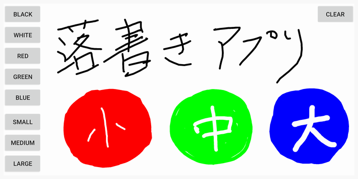
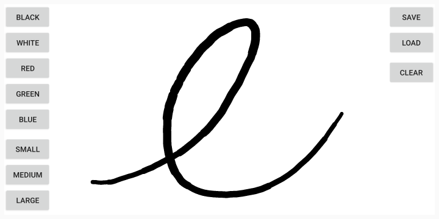

# 落書きアプリ

## 概要

- スワイプ操作により落書きを行うことができます。
- 線の色（5種類）、線の太さ（3段階）を変更できます。
- 筆圧によって線の太さが変化します。
- 描画内容を保存、復元することができます。

## 動作環境

- Android 5 (Android API Level 21) 以上。

## インストール

- githubのreleasesのページからダウンロードできます。パッケージファイル (RakugakiApp.apk) のリンクをタップすると、インストールパッケージがダウンロードされ、Androidにインストールしていいか確認を行います。
- アンインストールはAndroidアプリの標準的なアンインストール操作と同じです。
- Google Playに登録していない野良アプリです。自己責任でお願いします。

## 使い方

### 落書き画面

- 左側のボタンで線の色、線の太さを変更します。
- SAVEボタンで描画を保存します。
- LOADボタンで保存された描画を読み込みます。
- CLEARボタンで描画をリセットします。

## 既知の問題点

- なんらかの操作によってウィンドウサイズが変更されると描画がリセットされます。

## バージョン履歴

- 2019/02/28 筆圧対応
- 2019/02/24 SAVE/LOAD機能を実装
- 2019/02/18 RakugakiApp v1.00 リリース

## 著作権

- RakugakiAppの全ての配布物は「zlib/libpngライセンス」を適用します。
- (C) 2019 aktera.
